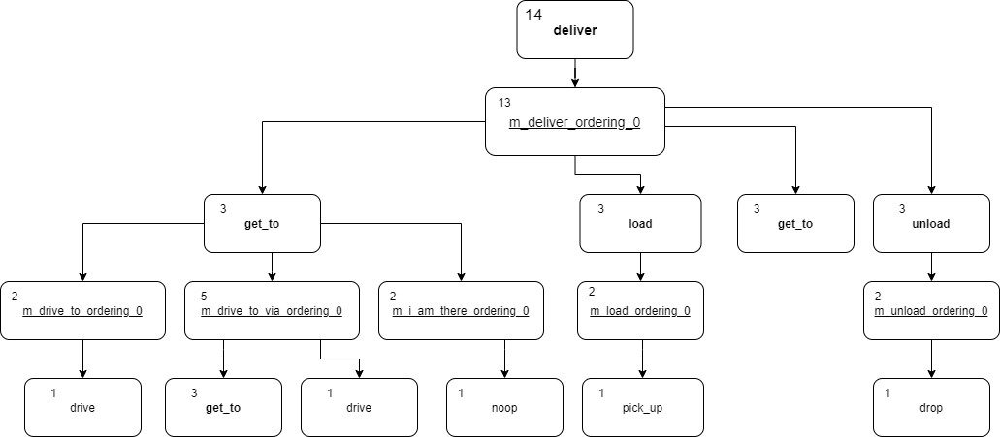

# Welcome to EPICpy
Extendable Planner with Interchangeable Components in Python

There is a known issue with the unittests for this project in Linux based operating systems. These issues will be rectified come time.

# Contents
* [Setup](#setup)
* [Running the planner](#running-the-planner)
  * [Running from Command Line](#running-from-command-line)
  * [Running Via Runner Class](#running-via-runner-class)
  * [Memory Requirements](#memory-requirements)
* [Example Problems](#example-problems)
* [Components](#components)
  * [Model](#model)
  * [Heuristics](#heuristics)
    * [Delete Relaxed](#delete-relaxed)
    * [Hamming Distance](#hamming-distance)
    * [Tree Distance](#tree-distance)
  * [Parameter Selectors](#parameter-selectors)
    * [All Parameters](#all-parameters)
    * [Requirement Selector](#requirement-selector)
  * [Search Queues](#search-queues)
    * [Total Cost](#total-cost)
    * [Greedy Best First Search (GBFS)](#greedy-best-first-search--gbfs-)
    * [Greedy Cost](#greedy-cost)
  * [Solving Algorithms](#solving-algorithms)
    * [Total Order Solver](#total-order-solver)
    * [Partial Order Solver](#partial-order-solver)
* [Component Selection](#component-selection)
  * [Total-Order Heuristics](#total-order-heuristics)
  * [Partial-Order Heuristics](#partial-order-heuristics)
  * [Search Queues](#search-queues)
  * [Parameter Selectors](#parameter-selectors)
  * [Solvers](#solvers)
* [Output](#output)
  * [Output Plan Reader](#output-plan-reader)
* [Running Unittests](#running-unittests)
* [System Evaluation](#system-evaluation)
* [Key File Paths](#key-file-paths)
* [Directions for Future Improvements](#directions-for-future-improvements)
  * [Heuristic](#heuristic)
  * [Parameter Selector](#parameter-selector)
  * [Search Queue](#search-queue)
  * [Solver](#solver)
  * [Running Unittests](#running-unittests)
* [Bug Solving](#bug-solving)
* [Demo Running Configurations](#demo-running-configurations)

# Setup
This system requires Python to be installed. Python downloads can be found [here](https://www.python.org/).

All other packages used by the system are included with Python as standard.

This system has been tested with Python versions 3.9 & 3.10

# Running the planner
There are two methods of running the planner, from the command line and by using the Runner class.

## Running from Command Line
From the main project directory the planner can be initiated using the command:

```commandline
python ./Runner.py <Domain File Path> <Problem File Path>
```

Additional help can be found via the following command:
```commandline
python ./Runner --help
```

## Running Via Runner Class
The Runner class can be imported to a program and used to control the planner. The following example shows how the operations of the class can be used:

```python
from runner import Runner

controller = Runner(domain_path, problem_path)
controller.parse_problem()
controller.parse_problem()
controller.set_solver(Solver)
controller.set_search_queue(SearchQueue)
controller.set_parameter_selector(ParameterSelector)
controller.set_heuristic(Heuristic)
result = controller.solve()
```

## Memory Requirements
Memory requirements depend entirely on the size of the problem being solved. Larger problems require more options to be searched which in turn uses more memory.


# Example Problems
Example problems can be found in the Tests/Examples directory.

# Components
This section explains the functionality provided by each component of the planner.

## Model
One of the most fundamental aspects of HTN planning is the idea of search state,
which store all the information regarding the environment during search.
In this project the class Model undertakes the role of representing and managing a search state.

At the beginning of search in a total-ordered problem usually only one model exists, during
search as multiple options for decompositions appear more models are created to consider all
decomposition options. Different decompositions add differing modifiers to the task network, this
brings in the requirement for models to store and manage task networks.

Source code for the model class can be found at **\Solver\model.py**.

## Heuristics
Heuristics are used to score states depending on how close to goal they are.
Each developed heuristic **MUST** inherit the heuristic class found at **/Solver/Heuristics/Heuristic.py**.
All heuristics are located within the **/Solver/Heuristics** folder.

### Delete Relaxed
The Delete and Ordering Relaxed Heuristic estimates the distance until a task
network is fully decomposed by employing a bottom up reliability strategy. A key feature of this
heuristic is that all delete effects of Actions and subtask orderings are completely ignored. This
creates some interesting states, since predicates and their inverses can be in the state at the same
time. For example (have, A) and not(have, A) can coexist in the state. When an Action is applied
to the state its name is also added, since a Method is applicable when all its subtasks are present in
the state. When a Method is decomposed the name of the Task it decomposes is added to the state.
This strategy is iterative; each iteration collects all Actions and Methods which are applicable to
the state. This continues until either all Tasks in the task network are present in the state or an
iteration where no Actions or Methods are applicable. The number of iterations taken to add all
Tasks in the task network to the state is returned as the estimated distance to goal.

### Hamming Distance
Hamming Distance proposed by Richard Hamming refers to the amount of times two strings
differ. We adapt this principle to calculate the number of times a state differs from the goal
conditions.

### Tree Distance
Since a HTN planning problem is considered complete when the task network is fully decomposed, we propose Tree Distance as a heuristic which estimates the cost to fully decompose a task
network. The diagram below shows an example of the estimated costs assigned to a Tasks, Methods, and
Actions in a problem. The cost of an Action is always 1. The cost of a Method is the combined
cost of all its subtasks plus 1. The cost of a Task is the cheapest cost of all its Methods plus 1.


## Parameter Selectors
Selecting parameters is an optimiser. Only selecting
parameters which are likely to be useful can save searching with parameters which will never
yield a valid plan. With less model’s to search, a goal can be found quicker.

### All Parameters
The AllParameters parameter selection class is the base parameter selection technique. All
combinations of objects which satisfy the parameter type are returned

### Requirement Selector
The RequirementSelection parameter selection class only selects parameters which satisfy the precondition constraints of a
parameter. This strategy aims to reduce the amount of parameter options returned to the solving
algorithm for consideration.


## Search Queues
During search multiple models are created. To contain and order these models we use a Search Queue.
All Search Queues are located within the **/Solver/Search_Queues** folder.

### Total Cost
The SearchQueue class is the default Search Queue and orders models based on the total estimated cost to goal.
The total cost is calculated as the cost thus far plus the estimated cost to goal which is provided by a heuristic.

### Greedy Best First Search (GBFS)
The Greedy Best First Search queue orders models solely on the heuristic estimate.

### Greedy Cost
The Greedy Cost Search Queue orders models by dividing the cost thus far by five and adding the estimated cost to goal.

## Solving Algorithms
The role of a solving algorithm is to apply Methods and Actions to models in order to find a valid solution.
Solving Algorithms can be found in the **/Solver/Solving_Algorithms** folder.

### Total Order Solver
In total-order problems orderings or subtasks are final. As such sequences of
subtasks can simply be iterated over and added to the task network during the expansion of Methods.

### Partial Order Solver
The Partial-Order Solver builds upon the functionality of the Total-Order Solver  by adding
consideration for different subtask orderings when decomposing Methods. To calculate all the possible orderings Khans algorithm is adapted (See /Internal_Representation/subtasks._create_orderings()).

# Component Selection
Interchangeable components can be set from the command line or via the Runner class as previously seen.

Four types of component can be interchanged; Heuristics, Search Queues, Parameter Selectors, and Solvers.
When setting each of these components from the command line two pieces of information are need to be set - class names and file paths.

The following tables show the class name and file path pairs used to set components.

## Total-Order Heuristics
| **Heuristic**             | **-heuModName** | **-heuPath**                          |
|---------------------------|-----------------|---------------------------------------|
| Delete & Ordering Relaxed | DeleteRelaxed   | Solver/Heuristics/delete_relaxed.py   |
| Tree Distance             | TreeDistance    | Solver/Heuristics/tree_distance.py    |
| Hamming Distance          | HammingDistance | Solver/Heuristics/hamming_distance.py |

## Partial-Order Heuristics
| **Heuristic**             | **-heuModName**             | **-heuPath**                                        |
|---------------------------|-----------------------------|-----------------------------------------------------|
| Delete & Ordering Relaxed | DeleteRelaxedPartialOrder   | Solver/Heuristics/delete_relaxed_partial_order.py   |
| Tree Distance             | TreeDistancePartialOrder    | Solver/Heuristics/tree_distance_partial_order.py    |
| Hamming Distance          | HammingDistancePartialOrder | Solver/Heuristics/hamming_distance_partial_order.py |

## Search Queues
| **Queue Type**    | **-searchQueueName**  | **-searchQueuePath**                                    |
|-------------------|-----------------------|---------------------------------------------------------|
| Total Cost        | SearchQueue           | Solver/Search_Queues/search_queue.py                    |
| Greedy Best First | GBFSSearchQueue       | Solver/Search_Queues/Greedy_Best_First_Search_Queue.py  |
| Greedy Cost       | GreedyCostSearchQueue | Solver/Search_Queues/Greedy_Cost_So_Far_Search_Queue.py |

## Parameter Selectors
| **Selector Name**    | **-paramSelectName** | **-paramSelectPath**                                |
|----------------------|----------------------|-----------------------------------------------------|
| All Parameters       | AllParameters        | Solver/Parameter_Selection/All_Parameters.py        |
| Requirement Selector | RequirementSelection | Solver/Parameter_Selection/Requirement_Selection.py |

## Solvers
| **Solver Name**      | **-solverModName** | **-solverPath**                            |
|----------------------|--------------------|--------------------------------------------|
| Total-Order Solver   | TotalOrderSolver   | Solver/Solving_Algorithms/total_order.py   |
| Partial-Order Solver | PartialOrderSolver | Solver/Solving_Algorithms/partial_order.py |

# Output
From the command line the plan found from a problem will be displayed on screen.
Using the Runner class a plan can be printed using the following method:

```python
Runner.output_result(Result)
```

The plan found for a problem can also be written to a Pickle file. From the command line the file path for output can be set using the following argument:
```commandline
python ./Runner <Domain File> <Problem File> -w <Output File Path>
```

Using the Runner class the same output can be achieved using the following method:
```python
Runner.output_result_file(Result, file_path)
```

An example of a plan being displayed is shown below:


## Output Plan Reader
Plans saved to Pickle files can be displayed on screen by using the plan reader tool. The plan reader can be found in the Tests/Evaluation directory.
```commandline
python ./output_plan_reader.py <Output File>
```

# Running Unittests
All the unittests can be run from the Tests/UnitTests directory using the following command:

```commandline
python ./All_Tests.py
```


From the root directory of the project, the following command can be used to find and
run all unit tests:
```commandline
python -m unittest discover ./Tests/
```

It is possible to run a particular unit test file, test class, or test using the 
following command structure:
```commandline
python3 -m unittest Tests.<Test File Name>.<Test Class Name>.<Test Name>
```

Note: The above command can also be used from the **Tests** directory by omitting the 
*Tests.* at the beginning of the command.

An example of this is as follows:
```commandline
python3 -m unittest test_Runner.RunnerTests.test_file_writing_command_line_args
```


# System Evaluation
System evaluation is composed in a similar manner to the unit tests. All evaluation files are contained in the Tests/Evaluation/Heuristic_Evaluation directory.
From here all evaluation tests can be executed using the following command:

```commandline
python ./AllEvaluationTests.py
```

The Tests/Evaluation/Heuristic_Evaluation/Archive directory is where all the results of the evaluation tests are stored.
Within this directory results are sorted by problem domain.
The <em>Heuristic_Evaluation_Data_Processing.ipynb</em> notebook visualises the results collected using graphs.

# Key File Paths
- Heuristics : /Solver/Heuristics
- Parameter Selectors : /Solver/Parameter_Selection
- Search Queues : /Solver/Search_Queues
- Solving Algorithms : /Solver/Solving_Algorithms
- Parsers : /Parsers
- Representation Objects : /Internal_Representation
- Example Problems : /Tests/Examples
- Evaluation methods : /Tests/Evaluation/Heuristic_Evaluation
- Unit Tests : /Tests/UnitTests

# Directions for Future Improvements
When developing new interchangeable components specific classes need to be inherited by any developed component.

## Heuristic
Developed Heuristics need to inherit the Heuristic class found in the Solver/Heuristics/Heuristic.py file.
There are some alternatives to inheriting the Heuristic class directly, the Pruning and NoPruning classes found in files Solver/Heuristics/pruning.py and Solver/Heuristics/no_pruning.py respectively.
Both of these classes inherit from the Heuristic class. The Pruning Class contains functionality for basic model pruning that can be inherited by other heuristics.
The PartialOrderPruning Class from file Solver/Heuristics/partial_order_pruning.py provides the same functionality but for partial-order problems.

## Parameter Selector
Developed Parameter Selectors need to inherit the ParameterSelector Class found in file Solver/Parameter_Selection/ParameterSelector.py.

## Search Queue
Developed Search Queues need to inherit the SearchQueue class found in Solver/Search_Queues/search_queue.py.

## Solver
Developed Solvers need to inherit the Solver class within the Solver/Solving_Algorithms/solver.py file.

## Running Unittests
All of the unittests can be run from the Tests/UnitTests directory using the following command:

```commandline
python ./All_Tests.py
```

# Bug Solving
When attempting to debug the system it is recommended that a debugger with breakpoints is used. To aid in the debugging
process the search procedure can be manually controlled using a script.
Below is a snippet of a test case from the file Tests/UnitTest/JSHOP_Solving_Tests.py:

```python
def test_rover_execution_part_guided(self):
    domain, problem, parser, solver = env_setup(False)
    parser.parse_domain(self.rover_test_path + "rover.jshop")
    parser.parse_problem(self.rover_test_path + "problem.jshop")

    execution_prep(problem, solver)
    solver.parameter_selector.presolving_processing(domain, problem)
    # res = solver.solve()

    solver._search(True)
```

In this example the search produce is completely controlled by the script shown. Notice that instead of using ```solver.solve()```
```solver._search(True)``` is being used. This acts as a step control for search. Each functional call of ```solver._search(True)```
will only decompose 1 Task, Method, or Action. This is an effective way to debug and track search procedure.

# Demo Running Configurations
1. Tests/Examples/Basic/basic.hddl Tests/Examples/Basic/pb1.hddl
2. Tests/Examples/Rover/domain.hddl Tests/Examples/Rover/p01.hddl
3. Tests/Examples/Rover/domain.hddl Tests/Examples/Rover/p02.hddl -heuModName DeleteRelaxed -heuPath Solver/Heuristics/delete_relaxed.py
4. Tests/Examples/Rover/domain.hddl Tests/Examples/Rover/p02.hddl -heuModName TreeDistance -heuPath Solver/Heuristics/tree_distance.py
5. Tests/Examples/Rover/domain.hddl Tests/Examples/Rover/p05.hddl -heuModName TreeDistance -heuPath Solver/Heuristics/tree_distance.py -searchQueueName GBFSSearchQueue -searchQueuePath Solver/Search_Queues/Greedy_Best_First_Search_Queue.py
6. Tests/Examples/Partial_Order/Rover/domain.hddl Tests/Examples/Partial_Order/Rover/pfile01.hddl -heuModName HammingDistance -heuPath Solver/Heuristics/hamming_distance.py -searchQueueName GreedyCostSearchQueue -searchQueuePath Solver/Search_Queues/Greedy_Cost_So_Far_Search_Queue.py
7. Tests/Examples/Rover/domain.hddl Tests/Examples/Rover/p01.hddl -solverModName TotalOrderSolver -solverPath Solver/Solving_Algorithms/total_order.py
8. Tests/Examples/Rover/domain.hddl Tests/Examples/Rover/p01.hddl -paramSelectName AllParameters -paramSelectPath Solver/Parameter_Selection/All_Parameters.py
9. Tests/Examples/JShop/rover/rover.jshop Tests/Examples/JShop/rover/pb1.jshop
